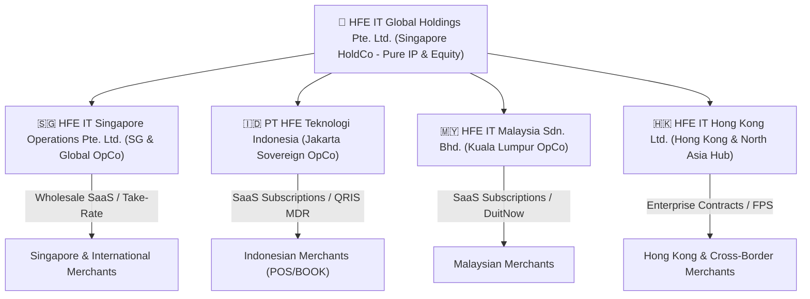
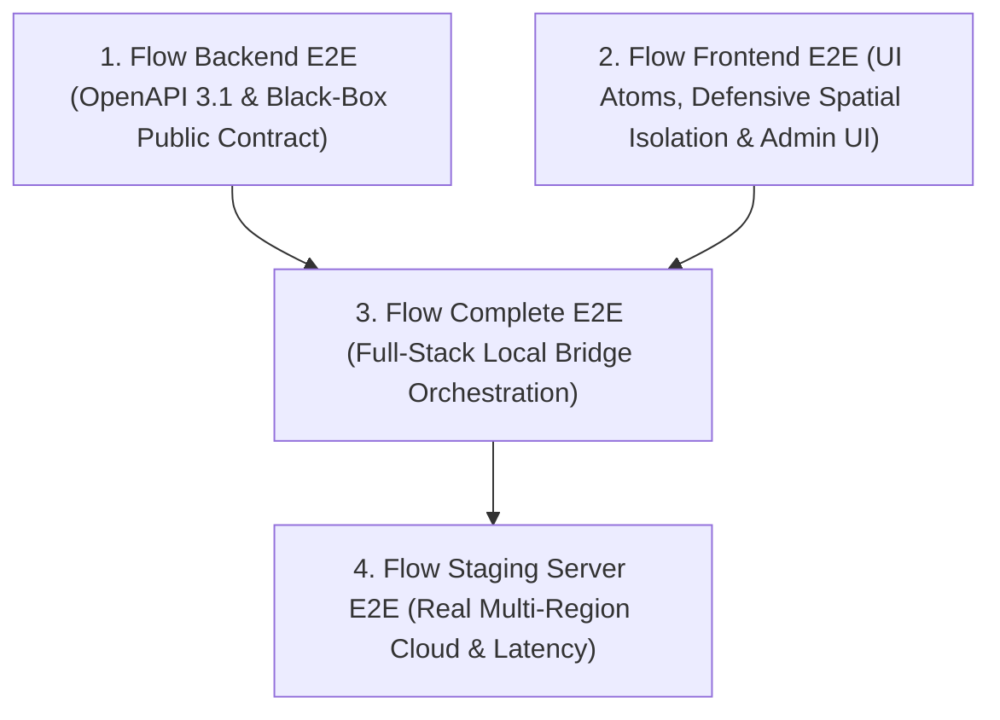

# HFE Ecosystem: Business Model, Product Topology & Multi-Tenancy Architecture

**Document ID:** `GLC-ARCH-TENANCY-001`  
**Status:** Approved Technical & Commercial Standard  
**Effective Date:** 2026-08-17  
**Corporate Entity Hierarchy:**  
- **Ultimate Global Holding:** HFE IT Global Holdings Pte. Ltd. (Singapore)
- **Singapore Operating OpCo:** HFE IT Singapore Operations Pte. Ltd. (Singapore)
- **Indonesia Operating OpCo:** PT HFE Teknologi Indonesia (Jakarta, Indonesia)
- **Malaysia Operating OpCo:** HFE IT Malaysia Sdn. Bhd. (Kuala Lumpur, Malaysia)
- **Hong Kong Regional Hub:** HFE IT Hong Kong Ltd. (Hong Kong SAR)

---

## 1. Corporate Topology & The 5-Stage Global Expansion Sequence

### 1.1 Multi-Tier Corporate Structure
PT HFE IT and its global group operate a multi-tier B2B2B commerce and financial technology platform partitioned into a Pure Asset Holding Company (HoldCo) and Regional Operating Companies (OpCos):



### 1.2 The 5-Stage Global Expansion Roadmap
1. **Stage 1: Singapore Genesis & Initial Global Hub (`SG`)**:
   - Initial incorporation via Sleek Singapore, built-in Xero Connector, PayNow SGD integration, and early cross-border pilot.
   - Operates the full suite of HFE features globally from Day 1.
2. **Stage 2: Indonesia Sovereign Subholding & Jakarta Node (`INA`)**:
   - Establishment of **PT HFE Teknologi Indonesia** (`Tenant 10`) and AWS Jakarta on-soil server node (`ap-southeast-3`) to strictly comply with Indonesian data sovereignty laws (UU PDP No. 27/2022 & PP No. 71/2019).
   - Integration with BCA SNAP BI, Dynamic QRIS, and DJP e-Faktur 4.0.
   - Migration of Indonesian merchant contact data to the domestic operating subledger.
3. **Stage 3: Malaysia Regional SEA Expansion (`MY`)**:
   - Expansion to Malaysia, establishing **HFE IT Malaysia Sdn. Bhd.** (`Tenant 12`), integration with **DuitNow QR (PayNet)**, FPX Online Banking, and **LHDN e-Invoicing** compliance in Ringgit (MYR).
4. **Stage 4: Corporate Restructuring: Clean HoldCo vs. Global Operating Split in Singapore**:
   - Separation into **`HFE IT Global Holdings Pte. Ltd.` (HoldCo - Tenant 01)** holding 100% Core IP and **`HFE IT Singapore Operations Pte. Ltd.` (SG OpCo - Tenant 11)** operating the commercial platform, achieving complete liability ring-fencing.
5. **Stage 5: Hong Kong Greater China & North Asia Regional Hub (`HK`)**:
   - Establishment of **HFE IT Hong Kong Ltd.** (`Tenant 30`), integration with **HKMA Faster Payment System (FPS)**, Inland Revenue Department (IRD) profits tax, and Greater Bay Area cross-border trade settlements (HKD/CNY/USD).

---

## 2. Product Portfolio & Unified Frontend Surfaces

| Product ID | Product Name | Description & Primary Capabilities | Target User Persona | Revenue Model |
| :--- | :--- | :--- | :--- | :--- |
| **Produk 1** | **HFE Core** | Headless Financial Posting Kernel, TigerBeetle Engine, 50-Connector Connect Hub, Tax Engine, Multi-Tenant Database. | Platform Operators, Core System Engineers | **Revenue Stream 1**: B2B Engine Usage (Per API mutation / monthly engine license). |
| **Produk 2** | **Hfeit POS** | Fast Cashier Register, Numpad, Cash Drawer Shift Sessions, Table Floorplans, KDS Kitchen Display, Local Stocktake. | Cashiers, Baristas, Store Managers | **Revenue Stream 2**: Monthly SaaS per register/outlet or transaction take-rate. |
| **Produk 3** | **Hfeit ORDER** | O2O Omnichannel Guest Dining, QR Table Self-Service Ordering, Instant Menu Cart, Payment Gateway (QRIS/Card). | Dine-in Restaurant Guests, Takeaway Customers | Included in SaaS Bundle / Small micro-fee per QR order. |
| **Produk 4** | **Hfeit BOARD** | Merchant Digital Storefront, Visual Menu Showcase, Brand Profile (Evolution of the Sekeding concept). | General Public, Online Customers | Included in Merchant Showcase Suite. |
| **Produk 5** | **Hfeit CARD** | Personal Consumer Loyalty Wallet, Digital Member Pass, Points Balance, Personal Receipts History. | Loyal Individual Consumers & Members | Loyalty Engine Module / Add-on. |
| **Produk 6** | **Hfeit BOOK** | Rebuilt CB-Client: Chart of Accounts, Double-Entry General Journals, Trial Balance, Balance Sheet, P&L, e-Faktur Pajak, & Multi-Entity Practice. | Enterprise Merchants, CFOs, Accounting Firms, CPAs | Core Ledger & Enterprise Add-on. |

### 2.1 Unified Frontend Experience for Merchant & Super-Admin
Super-Admins manage the entire platform directly through the official **HFE-X Frontend Platform (`hfe-pos`)**:
- **Pilar 0 [CORE] (`CoreLandingView.tsx` & `ConnectHubAdminView.tsx`)**: Connect Hub 50-connector catalog management, Webhook Relay inspector, and embedded Scalar OpenAPI Explorer.
- **Pilar 2 [ADMIN] (`AdminPortalView.tsx`)**: Cell Shard live rebalancer, Four-Eyes Approval center, Wholesale B2B metering console, and Multi-Company Holding governance.

---

## 3. Multi-Tenancy & Provisioning Architecture

### 3.1 Tenant Allocation Rules & The 2-Digit System Space (`01 .. 99`)
To ensure complete mathematical synergy with our 2-digit segmented naming convention (`01-01-01`), **Tenant IDs 01 through 99 are strictly reserved for HFE-IT Infrastructure & Regional OpCos**:

```text
 ┌─────────────────────────────────────────────────────────────────────────────────────────────────┐
 │ 👑 BLOK 01 - 09: CORE HOLDINGS & MASTER PLATFORM INFRASTRUCTURE                                 │
 │    • Tenant 01: HFE IT Global Holdings Pte. Ltd. (Global HoldCo & Core IP Master)              │
 │    • Tenant 02: HFE-IT Experience Global (Platform Operator & Wholesale Reseller Mesh)          │
 │    • Tenant 03: HFE Global Connect Hub & Third-Party Relay Node                                 │
 │    • Tenant 04: HFE Global Treasury & FX Settlement Clearing Node                               │
 │    • Tenant 05: HFE Developer Sandbox & Simulation Environment                                  │
 │    • Tenant 06: HFE Security, Audit & Compliance Archival Vault                                 │
 │    • Tenant 07 - 09: Reserved for AI Autonomous Financial Kernels & DR Recovery                 │
 ├─────────────────────────────────────────────────────────────────────────────────────────────────┤
 │ 🌏 BLOK 10 - 29: ASIA TENGGARA (ASEAN REGIONAL OPCOS)                                           │
 │    • Tenant 10: PT HFE Teknologi Indonesia (Jakarta Sovereign OpCo)                             │
 │    • Tenant 11: HFE IT Singapore Operations Pte. Ltd. (Singapore OpCo)                          │
 │    • Tenant 12: HFE IT Malaysia Sdn. Bhd. (Kuala Lumpur OpCo)                                   │
 │    • Tenant 13: HFE IT Thailand Co., Ltd.                                                       │
 │    • Tenant 14: HFE IT Vietnam LLC                                                              │
 │    • Tenant 15: HFE IT Philippines Inc.                                                         │
 │    • Tenant 16 - 29: Reserved for Southeast Asian Markets & Regional Expansion                  │
 ├─────────────────────────────────────────────────────────────────────────────────────────────────┤
 │ 🏮 BLOK 30 - 49: ASIA TIMUR & PASIFIK (EAST ASIA & OCEANIA OPCOS)                               │
 │    • Tenant 30: HFE IT Hong Kong Ltd. (Greater China & North Asia Hub)                          │
 │    • Tenant 31: HFE IT Japan K.K.                                                               │
 │    • Tenant 32: HFE IT Australia Pty Ltd.                                                       │
 │    • Tenant 33: HFE IT South Korea Co., Ltd.                                                    │
 │    • Tenant 34 - 49: Reserved for Asia-Pacific Regional Hubs                                    │
 ├─────────────────────────────────────────────────────────────────────────────────────────────────┤
 │ 🌍 BLOK 50 - 69: EROPA & TIMUR TENGAH (EMEA OPCOS)                                              │
 │    • Tenant 50: HFE IT UK Ltd. (London Hub)                                                     │
 │    • Tenant 51: HFE IT UAE Ltd. (Dubai Hub)                                                     │
 │    • Tenant 52: HFE IT Europe B.V. (Amsterdam Hub)                                              │
 │    • Tenant 53 - 69: Reserved for Middle East & European Markets                                │
 ├─────────────────────────────────────────────────────────────────────────────────────────────────┤
 │ 🗽 BLOK 70 - 89: AMERIKA (AMERICAS OPCOS)                                                       │
 │    • Tenant 70: HFE IT US Inc. (Americas Hub)                                                   │
 │    • Tenant 71: HFE IT Canada Ltd.                                                              │
 │    • Tenant 72 - 89: Reserved for North & Latin American Markets                                │
 ├─────────────────────────────────────────────────────────────────────────────────────────────────┤
 │ 🛡️ BLOK 90 - 99: SPECIAL PURPOSE VEHICLES (SPV) & EMERGENCY BREAK-GLASS NODES                   │
 ├─────────────────────────────────────────────────────────────────────────────────────────────────┤
 │ 🛒 BLOK 100+: PUBLIC COMMERCIAL MERCHANTS (KAFE, RESTO, RETAIL & ENTERPRISE PELANGGAN)          │
 │    • All commercial merchant registrations are dynamically provisioned starting at Tenant 100+. │
 └─────────────────────────────────────────────────────────────────────────────────────────────────┘
```

### 3.2 Provisioning Flow for Commercial Merchants (Tenant 100+)
1. When a new Merchant signs up on HFE-IT Experience:
2. HFE-IT Experience invokes the HFE Core provisioning endpoint:
   ```http
   POST /api/v2/company-books/provision
   Content-Type: application/json
   
   {
     "company_name": "Restoran Kopi ABC",
     "billing_parent_tenant_id": "TENANT-02",
     "coa_template": "ID_FNB_STANDARD",
     "tax_profile": "ID_PPN_11"
   }
   ```
3. HFE Core provisions a new company book (e.g. `TENANT-0100` / `company_book_id UUID`).
4. The merchant operates POS, ORDER, BOARD, and CARD within their own isolated book boundaries.
5. At the end of the billing cycle:
   - **HFE Core** meters engine compute/posting volume and invoices **Tenant 02 (HFE-IT Experience / OpCo)**.
   - **OpCo** bills the **Merchant** according to its merchant subscription/transaction pricing.

---

## 4. Architectural Invariants & Hard Constraints

1. **Zero Cross-Tenant Data Leakage**: Every query and mutation in HFE Core must enforce `WHERE company_book_id = $merchant_book_id`.
2. **Immutable System Definitions**: Merchants instantiate connectors and CoA templates from Tenant 01, but cannot alter the root definitions.
3. **Financial Posting Kernel Invariant**: No direct SQL updates to account balances; all financial movements must resolve through `PostingService` and double-entry debits/credits.
4. **Permanent Audit Trail**: Posted journals and finalized period close records cannot be hard-deleted; corrections must execute via reversal entries.
5. **Asset Isolation**: Connector icons and platform assets resolve through `tenant01` contact subledgers with zero untrusted external CDN dependencies.
6. **Zero-Downtime High Availability Gate**: All database migrations and cell node rebalancing must execute online without dropping active cashier connections ($99.999\%$ SLA target).

---

## 5. Repository Topology & Mapping

- **Backend Repository (`headless-company-books`)**:
  - Contains **Produk 1 (HFE Core Engine)**.
  - Master Orchestrator: `python3 scripts/hfe-rad0.py`
- **Frontend Repository (`hfe-pos`)**:
  - Contains **HFE-X Platform (Produk 2..5: POS, ORDER, BOARD, CARD + Rebuilt BOOK)**.
  - Master Orchestrator: `python3 scripts/hfex-rad0.py`

---

## 6. Unified Contact Subledger & Dynamic Namespaced Scope (`Hfeit:<SCOPES>`)

All corporate, partner, regulator, merchant, and consumer contacts across HFE Core and HFE-IT Experience are centrally managed in **Tenant 01's Contact Subledger** with local operational delegation. 

To prevent cross-product data duplication and cleanly track lifecycle progression, contacts are partitioned using the **`Hfeit:<SCOPES>`** dynamic namespace:

### 6.1 Canonical Scope Tokens
- `CORE`: Internal platform, cloud infrastructure, financial regulators, and connector master definitions (e.g. BCA SNAP, Xero, DJP e-Faktur, AWS, IRAS, LHDN, HKMA).
- `MERCHANT`: Business entities originating from Full Merchant Signups (POS / Backoffice / Cashier users).
- `BOARD`: Entities originating from Storefront / Landing Page-only signups (Evolusi Sekeding).
- `CARD`: Individual consumer members originating from Digital Loyalty Card signups.
- `AUDITOR_PRACTICE`: Accounting firms, CPAs, and corporate secretarial partners managing multiple client books.

### 6.2 Multi-Scope Combinations
A single contact entity can seamlessly hold multiple scope tags as their relationship evolves, separated by commas:
- `Hfeit:CORE` — Platform master connector or bank API partner.
- `Hfeit:BOARD` — Small food stall utilizing only digital menu storefront.
- `Hfeit:CARD` — Individual consumer holding a member pass.
- `Hfeit:MERCHANT,BOARD` — Merchant running in-store POS with active online storefront.
- `Hfeit:BOARD,MERCHANT,CARD,BOOK` — Full-ecosystem enterprise merchant running POS, online storefront, loyalty member cards, and general ledger.

---

## 7. Group Policy Data Management & Dual-Tier Contact Governance

Corporate contacts operate under a **Dual-Tier Governance Model** governed by `GroupPolicy: DataManagementPolicy`:
1. **Global Holding Master Registry (Tenant 01 - Singapore)**: Retains global corporate entity metadata (Legal Name, Global ID, Valuation, Contract Tier) for investor reporting, group valuation, and global AML screening.
2. **Local Operating Subledgers (Jakarta, KL, HK)**: Directly manage granular local operational data (NPWP/Tax IDs, local PIC contacts, local bank feeds, and cashier logins).
3. **Data Residency Compliance (UU PDP)**: Upward synchronization strips private personal identification information (PII), transmitting only anonymized financial summaries and corporate entity profiles to Holding.

---

## 8. Zero-Downtime Cell-Based Architecture & Dynamic Routing Mesh

To achieve our **Target 0 Downtime (99.999% SLA)** and dynamically scale nodes across regions:
1. **Global Anycast Edge Router**: Inspects incoming API requests (`X-Company-Book-Id` or OIDC JWT target claim) in $<0.1\text{ms}$.
2. **Global Cell Directory**: In-memory routing table mapping each `company_book_id` to its assigned server cell:
   - `JKT-CELL-01..N` (Jakarta Multi-Cell Cluster)
   - `SIN-CELL-01..N` (Singapore Multi-Cell Cluster)
   - `KUL-CELL-01..N` (Kuala Lumpur Multi-Cell Cluster)
   - `HKG-CELL-01..N` (Hong Kong Multi-Cell Cluster)
3. **Online Live Rebalancing**: Nodes can be provisioned in seconds. Moving a merchant between cells utilizes background dual-write replication and an atomic $<1\text{ms}$ routing flip with zero dropped connections.

---

## 9. The Master End-to-End Lifecycle Scenario (`SCN-FULL-ECOSYSTEM-01`)

The following real-world scenario connects all 6 products across both repositories, the 5-stage expansion roadmap, and the complete Seed-to-Cup conglomerate journey:

### Act 1: Genesis & The Humble Food Cart (Produk 4: Hfeit BOARD)
- **Actor**: Mas Budi launches a roadside coffee cart ("Warung Kopi Budi").
- **Action**: Budi signs up on HFE-IT Experience needing only a digital menu & landing page (`Hfeit:BOARD`).
- **Execution**: HFE Core creates an isolated `company_book_id` (`Tenant 100`). Menu goes live at `kopibudi.hfeit.board`.

### Act 2: Viral Success & Physical Expansion (Produk 2 & 3: POS & ORDER)
- **Event**: Warung Kopi Budi goes viral. Budi opens a 20-table cafe.
- **Action**: Budi clicks "Activate POS Register & QR Dining" in HFE-X.
- **Execution**: State machine promotes scope: `Hfeit:BOARD` ──► `Hfeit:BOARD,MERCHANT`. Terminals activate fast numpad POS, table floorplans (`CapacityBadge 👥 3/4 Kursi`), and QR table stickers (Produk 3 Hfeit ORDER) on tables 1..20.

### Act 3: Rush-Hour Power Outage & Network Failure (Offline-First Resilience)
- **Event**: Friday rush-hour (150 diners). Fiber-optic cable severed.
- **Execution**: Cashiers continue ordering and printing tickets via **IndexedDB client storage**. Upon internet recovery 90 minutes later, HFE-X flushes sync buffer with `X-Idempotency-Key` headers to HFE Core. All 150 transactions post with zero duplicates.

### Act 4: Split-Bill & Customer Loyalty (Produk 5: Hfeit CARD)
- **Event**: Table 8 (4 guests) completes dining. Guest A presents **Hfeit CARD** (VIP Member Pass) to redeem 500 points.
- **Execution**: Remaining balance split 4 ways via Dynamic QRIS. Webhook Relay matches callbacks against BCA SNAP BI bank feed, posting double-entry settlements and freeing Table 8.

### Act 5: Enterprise Scaling & Self-Managed Accounting (Produk 6: Hfeit BOOK)
- **Event**: Monthly revenue exceeds Rp 2 Billion. Budi activates **Modul BOOK** (`Hfeit:BOARD,MERCHANT,CARD,BOOK`).
- **Execution**: HFE Core constructs Chart of Accounts, General Journals, Trial Balance ($Debits == Credits$), and exports DJP e-Faktur 4.0 XML/CSV slips.

### Act 6: Professional Accounting Practice & External Audit (Multi-Book Practice)
- **Event**: Budi retains external accounting firm *KAP Santoso & Rekan*.
- **Execution**: KAP Santoso uses the **Multi-Book Switcher** in HFE-X (`Hfeit:AUDITOR_PRACTICE`) to manage 50 client books, posting adjusting entries with SHA-256 digital audit seals.

### Act 7: Wholesale Settlement & Platform Profit Realization
- **Event**: Month-End Billing Settlement.
- **Execution**: HFE Core (Tenant 01) calculates compute mutations and invoices Wholesale Engine Fee of Rp 150.000 to Tenant 02. Tenant 02 bills Budi's retail SaaS of Rp 499.000 via Virtual Account auto-debit.

### Act 8: Singapore Global Expansion & The Sleek Adoption Journey (Stage 1)
- **Event**: PT HFE IT expands internationally, incorporating **HFE IT Global Pte. Ltd.** in Singapore via **Sleek Singapore**.
- **Execution**: Sleek clients operate on Xero; HFE IT uses **`BOOK`**. HFE IT deploys its native **Xero Connector** in Connect Hub to sync PayNow SGD bank feeds. Observing HFE's superior multi-jurisdiction engine, Sleek signs a Strategic Enterprise Agreement and migrates regional clients onto **HFE `BOOK`**.

### Act 9: Indonesian Subholding & Domestic Enterprise Sales (Stage 2)
- **Event**: Explosive domestic growth leads to the formal incorporation of **PT HFE Teknologi Indonesia** (`Tenant 10`) on AWS Jakarta server nodes (`ap-southeast-3`).
- **Execution**: PT Indo closes an enterprise implementation deal with Boga Group (120 restaurant branches), issuing official DJP PPN 11% invoices in IDR. All Indonesian merchant contacts are re-homed into the domestic sovereign subledger.

### Act 10: Malaysia Regional Expansion & DuitNow Integration (Stage 3)
- **Event**: HFE expands to Malaysia, establishing **HFE IT Malaysia Sdn. Bhd.** (`Tenant 12`).
- **Execution**: HFE Core activates the **MY Jurisdictional Profile**, integrating **DuitNow QR (PayNet)**, FPX banking feeds, and **LHDN e-Invoicing** compliance for hundreds of cafes in Kuala Lumpur and Penang.

### Act 11: Corporate Restructuring: Clean HoldCo vs. Global OpCo Split (Stage 4)
- **Event**: Group volume reaches institutional enterprise scale.
- **Execution**: HFE formalizes the separation into **`HFE IT Global Holdings Pte. Ltd.` (HoldCo - Tenant 01)** holding 100% Core IP and **`HFE IT Singapore Operations Pte. Ltd.` (SG OpCo - Tenant 11)** operating the commercial platform, achieving complete liability ring-fencing.

### Act 12: Hong Kong Regional Hub & Greater Bay Cross-Border Trade (Stage 5)
- **Event**: Establishment of **HFE IT Hong Kong Ltd.** (`Tenant 30`) to serve North Asia.
- **Execution**: Integration with **HKMA Faster Payment System (FPS)** and IRD Profits Tax. HFE Core handles multi-currency cross-border trade settlements across HKD, SGD, MYR, IDR, and USD seamlessly with automatic intercompany eliminations.

### Act 13: The "Seed-to-Cup" Conglomerate Evolution (Nusantara Coffee Group)
This act demonstrates how a single tenant scales through the full multi-product, multi-company, and multi-country capability matrix:
1. **Phase 1 (BSD Cafe - Merchant Suite on Singapore Node)**: Mas Budi opens a cafe in BSD using only the Merchant Suite (`POS`, `ORDER`, `CARD`). He does not use formal double-entry bookkeeping (`BOOK`) yet, tracking only daily cash shifts on Singapore Server Node `SIN-CELL-01`.
2. **Phase 2 (Roasting Factory - The Aha! Moment & BOOK Activation)**: Budi builds a coffee roasting factory (PT Nusantara Sangrai) to supply his cafe and sell wholesale. Facing manufacturing complexity (green bean shrinkage, gas costs, wholesale receivables), Budi upgrades to **`BOOK`** (`Hfeit:BOARD,MERCHANT,CARD,BOOK`), unlocking Bill of Materials (BOM) inventory assembly and double-entry general ledger.
3. **Phase 3 (Indonesian Data Sovereignty Mandate & Live Zero-Downtime Migration)**: Indonesian regulators (UU PDP / BI) mandate on-soil data residency. HFE commissions the Jakarta Server Node (`ap-southeast-3` / `JKT-CELL-01`). HFE Core executes a **Live Shard Dual-Write Migration** moving Budi's BSD Cafe and Roasting Factory books from Singapore to Jakarta with $<1\text{ms}$ atomic routing flip and 0 dropped cashier carts.
4. **Phase 4 (Singapore Global Trading & 50-Ha Gayo Plantation)**: Budi incorporates **Nusantara Coffee Global Pte. Ltd.** in Singapore via Sleek (hosted on Singapore Node) for container exports to Tokyo/London, and acquires a **50-Ha Coffee Plantation in Gayo** (hosted on Jakarta Node under PSAK 69 Biological Asset Accounting). Budi manages his entire seed-to-cup empire across **POS, BOOK, 4 Companies, and 2 Countries** from a single HFE-X console!

---

## 10. Scenario-Driven Preset Accumulation Engine

Every executed business scenario automatically compiles into our production-ready **System Presets Registry in Tenant 01**:
1. **Chart of Accounts (CoA) Presets**: `COA_ID_FNB_CAFE`, `COA_ID_ROASTING_MFG`, `COA_ID_AGRICULTURE_FARM`, `COA_SG_CROSSBORDER_TRADING`, `COA_MY_RETAIL_FNB`, `COA_HK_REGIONAL_TRADING`.
2. **Business Policy (`CompanyPolicy`) Presets**: `POLICY_CAFE_FAST_CASHIER`, `POLICY_ROASTING_BOM_SHRINKAGE`, `POLICY_PLANTATION_FAIR_VALUE`, `POLICY_WHOLESALE_METERING`.
3. **Jurisdictional Tax Presets**: `TAX_ID_PB1_PPN`, `TAX_SG_IRAS_GST_9`, `TAX_MY_LHDN_EINVOICE`, `TAX_HK_IRD_PROFITS`.

---

## 11. The 4-Tier End-to-End Verification Hierarchy & Dual-Plane Testing Standard



### 11.1 The Dual-Plane Contract Testing Standard
- **Public Merchant Plane (`/api/v2/company-books/...`)**: Tested 100% against the public OpenAPI 3.1 contract, DTO schemas, and public authentication headers (`Authorization: Bearer <JWT>`, `X-Company-Book-Id`, `X-Idempotency-Key`, `X-Hfe-Signature`). Private structs are never called directly.
- **Internal Admin Control Plane (`/api/v2/admin/...`)**: Tested via Internal Admin Privileged Contracts for Super-Admin operations (Cell Shard rebalancing, master connector publishing, wholesale billing triggers, and Four-Eyes approval signatures).

### 11.2 Frontend E2E Testing for Merchant & Admin Surfaces
All merchant surfaces (POS, ORDER, BOARD, CARD, BOOK) and admin management surfaces (Pilar 0 CORE and Pilar 2 ADMIN) are tested directly through the frontend experience layer via Vitest, AST pattern inspection, and DOM spatial isolation assertions.
