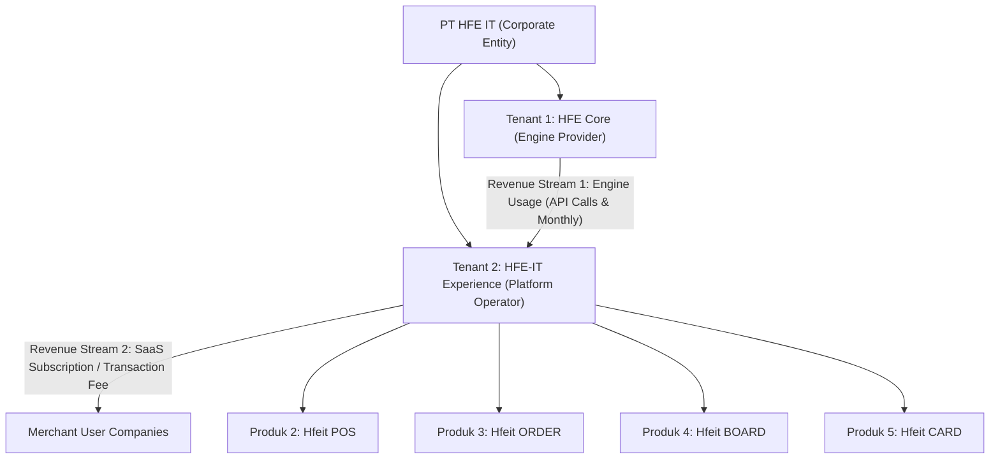

# HFE Ecosystem: Business Model, Product Topology & Multi-Tenancy Architecture

**Document ID:** `GLC-ARCH-TENANCY-001`  
**Status:** Approved Technical & Commercial Standard  
**Effective Date:** 2026-08-17  
**Corporate Entity:** PT HFE IT (Indonesia) & HFE IT Global Pte. Ltd. (Singapore)  

---

## 1. Executive Summary & Corporate Topology

**PT HFE IT** operates a 2-tier B2B2B commerce and financial technology platform:
1. **HFE Core (Engine Provider)**: The headless financial kernel, double-entry ledger, Connect Hub marketplace, and multi-tenant compliance engine.
2. **HFE-IT Experience (Platform Operator)**: The unified frontend experience platform operating the retail, guest, personal, and storefront surfaces.



---

## 2. Product Portfolio Breakdown

| Product ID | Product Name | Description & Primary Capabilities | Target User Persona | Revenue Model |
| :--- | :--- | :--- | :--- | :--- |
| **Produk 1** | **HFE Core** | Headless Financial Posting Kernel, TigerBeetle Engine, 50-Connector Connect Hub, Tax Engine, Multi-Tenant Database. | Platform Operators, Core System Engineers | **Revenue Stream 1**: B2B Engine Usage (Per API mutation / monthly engine license). |
| **Produk 2** | **Hfeit POS** | Fast Cashier Register, Numpad, Cash Drawer Shift Sessions, Table Floorplans, KDS Kitchen Display, Local Stocktake. | Cashiers, Baristas, Store Managers | **Revenue Stream 2**: Monthly SaaS per register/outlet or transaction take-rate. |
| **Produk 3** | **Hfeit ORDER** | O2O Omnichannel Guest Dining, QR Table Self-Service Ordering, Instant Menu Cart, Payment Gateway (QRIS/Card). | Dine-in Restaurant Guests, Takeaway Customers | Included in SaaS Bundle / Small micro-fee per QR order. |
| **Produk 4** | **Hfeit BOARD** | Merchant Digital Storefront, Visual Menu Showcase, Brand Profile (Evolution of the Sekeding concept). | General Public, Online Customers | Included in Merchant Showcase Suite. |
| **Produk 5** | **Hfeit CARD** | Personal Consumer Loyalty Wallet, Digital Member Pass, Points Balance, Personal Receipts History. | Loyal Individual Consumers & Members | Loyalty Engine Module / Add-on. |
| **Produk 6** | **Hfeit BOOK** | Rebuilt CB-Client: Chart of Accounts, Double-Entry General Journals, Trial Balance, Balance Sheet, P&L, e-Faktur Pajak, & Multi-Entity Practice. | Enterprise Merchants, CFOs, Accounting Firms, CPAs | Core Ledger & Enterprise Add-on. |

---

## 3. Multi-Tenancy & Provisioning Architecture

### 3.1 Tenant 1 (HFE Core Engine)
- **Role**: Root System Operator.
- **Tenant Scope**: Stores global connector catalog (50 connectors), baseline Chart of Accounts (CoA) templates, national jurisdictional tax profiles (DJP, Batam FTZ, IRAS Singapore), and developer API documentation (Scalar OAS 3.1).
- **Security**: Strictly locked to Super-Admin credentials. Merchant tenants cannot read or mutate Tenant 1 system data.

### 3.2 Tenant 2 (HFE-IT Experience Platform Operator)
- **Role**: Master Tenant User / Reseller Account inside HFE Core.
- **Tenant Scope**: Owns and orchestrates the merchant ecosystem.
- **Provisioning Flow**:
  1. When a new Merchant (e.g. *"Restoran Kopi ABC"*) signs up on HFE-IT Experience:
  2. HFE-IT Experience invokes the HFE Core provisioning endpoint:
     ```http
     POST /api/v2/company-books/provision
     Content-Type: application/json
     
     {
       "company_name": "Restoran Kopi ABC",
       "billing_parent_tenant_id": "TENANT-2-EXPERIENCE",
       "coa_template": "ID_FNB_STANDARD",
       "tax_profile": "ID_PPN_11"
     }
     ```
  3. HFE Core creates a new isolated `Company` with its own `company_book_id UUID`.
  4. The merchant operates POS, ORDER, BOARD, and CARD within their own isolated book boundaries.
  5. At the end of the billing cycle:
     - **HFE Core** meters engine compute/posting volume and invoices **Tenant 2 (HFE-IT Experience)**.
     - **HFE-IT Experience** bills the **Merchant** according to its merchant subscription/transaction pricing.

---

## 4. Architectural Invariants & Hard Constraints

1. **Zero Cross-Tenant Data Leakage**: Every query and mutation in HFE Core must enforce `WHERE company_book_id = $merchant_book_id`.
2. **Immutable System Definitions**: Merchants instantiate connectors and CoA templates from Tenant 1, but cannot alter the root definitions.
3. **Financial Posting Kernel Invariant**: No direct SQL updates to account balances; all financial movements must resolve through `PostingService` and double-entry debits/credits.
4. **Permanent Audit Trail**: Posted journals and finalized period close records cannot be hard-deleted; corrections must execute via reversal entries.
5. **Asset Isolation**: Connector icons and platform assets resolve through `tenant1` contact subledgers with zero untrusted external CDN dependencies.

---

## 5. Repository Topology & Mapping

- **Backend Repository (`headless-company-books`)**:
  - Contains **Produk 1 (HFE Core Engine)**.
  - Master Orchestrator: `python3 scripts/hfe-rad0.py`
- **Frontend Repository (`hfe-pos`)**:
  - Contains **HFE-X Platform (Produk 2..5: POS, ORDER, BOARD, CARD + Rebuilt BOOK)**.
  - Master Orchestrator: `python3 scripts/hfex-rad0.py`

---

## 6. Unified Contact Subledger & Dynamic Namespaced Scope (`Hfeit:<SCOPES>`)

All corporate, partner, regulator, merchant, and consumer contacts across HFE Core and HFE-IT Experience are centrally managed in **Tenant 1's Contact Subledger**. 

To prevent cross-product data duplication and cleanly track lifecycle progression, contacts are partitioned using the **`Hfeit:<SCOPES>`** dynamic namespace:

### 6.1 Canonical Scope Tokens
- `CORE`: Internal platform, cloud infrastructure, financial regulators, and connector master definitions (e.g. BCA SNAP, Xero, DJP e-Faktur, AWS, IRAS).
- `MERCHANT`: Business entities originating from Full Merchant Signups (POS / Backoffice / Cashier users).
- `BOARD`: Entities originating from Storefront / Landing Page-only signups (Evolusi Sekeding).
- `CARD`: Individual consumer members originating from Digital Loyalty Card signups.
- `AUDITOR_PRACTICE`: Accounting firms, CPAs, and corporate secretarial partners managing multiple client books.

### 6.2 Multi-Scope Combinations
A single contact entity can seamlessly hold multiple scope tags as their relationship evolves, separated by commas:
- `Hfeit:CORE` — Platform master connector or bank API partner.
- `Hfeit:BOARD` — Small food stall utilizing only digital menu storefront.
- `Hfeit:CARD` — Individual consumer holding a member pass.
- `Hfeit:MERCHANT,BOARD` — Merchant running in-store POS with active online storefront.
- `Hfeit:BOARD,MERCHANT,CARD,BOOK` — Full-ecosystem enterprise merchant running POS, online storefront, loyalty member cards, and general ledger.

---

## 7. Core Operational & Lifecycle Journeys

### 7.1 The Genesis Bootstrapping Journey (Day 0)
1. System migration boots up Tenant 1 (`BOOK-SYSTEM-ROOT` & `BOOK-HFEIT-HQ`) and Tenant 2 (`TENANT-2-EXPERIENCE`).
2. An automatic **Intercompany Wholesale Bilateral Link** is created between Tenant 1 (PT HFE IT) and Tenant 2 (HFE-IT Experience), pre-authorizing paired Accounts Receivable (in T1) and Accounts Payable (in T2).

### 7.2 The Merchant Scope Upgrade & Expansion Journey
1. A merchant initially onboarded with `Hfeit:BOARD` (storefront menu only) opts to activate physical in-store POS.
2. In the merchant dashboard, clicking "Activate POS Terminal" triggers a state machine promotion:
   `SCOPE: Hfeit:BOARD` ──► `SCOPE: Hfeit:BOARD,MERCHANT`
3. HFE Core provisions terminal register IDs and cashier shifts in the existing company book without data loss or re-onboarding.

### 7.3 Automated Month-End Wholesale Metering & Invoicing Cycle
1. **Day 30 (23:59:59 UTC)**: HFE Core automated cron calculates total compute volume across all merchant companies under Tenant 2.
2. **Wholesale Invoice Issued**: Tenant 1 issues an official B2B invoice to Tenant 2 (Posting: `Dr. Piutang Usaha Tenant 2` vs `Cr. Pendapatan Lisensi Engine HFE Core`).
3. **Day 1 (00:00:01 UTC)**: HFE-IT Experience generates and dispatches retail subscription invoices to individual merchants via Virtual Account / Card auto-debit.

### 7.4 Dunning, Grace Period & Statutory Archival Journey
1. **Days 1–7 (Active Grace Period)**: If a merchant's monthly retail payment fails, POS cashier terminals continue operating with a subtle dashboard reminder banner.
2. **Day 8+ (Read-Only Suspension)**: The company status transitions to `STATUS: SUSPENDED_READONLY`. New orders and mutations are blocked, but historical journals, reports, and tax receipts remain viewable.
3. **Statutory 10-Year Archival**: When a business permanently closes, its book transitions to `STATUS: ARCHIVED_STATUTORY` with full cryptographic tamper-proofing, strictly satisfying Indonesian statutory tax audit laws (UU KUP).

---

## 8. The Master End-to-End Lifecycle Scenario (`SCN-FULL-ECOSYSTEM-01`)

The following real-world scenario connects all 6 products across both repositories, demonstrating system resilience against operational friction:

### Act 1: Genesis & The Humble Food Cart (Produk 4: Hfeit BOARD)
- **Actor**: Mas Budi launches a humble roadside street-food cart ("Warung Kopi Budi").
- **Action**: Budi signs up on HFE-IT Experience needing only a digital menu & online landing page (`Hfeit:BOARD`).
- **Engine Execution**: HFE-IT Experience calls HFE Core `provision` endpoint. HFE Core registers an isolated `company_book_id` with lightweight storefront metadata. Budi's menu goes live at `kopibudi.hfeit.board`.

### Act 2: Viral Success & Physical Expansion (Produk 2 & 3: POS & ORDER)
- **Event**: Warung Kopi Budi goes viral on social media. Budi leases a 2-story commercial shophouse with 20 dining tables.
- **Action**: Budi clicks "Activate POS Register & QR Dining" in HFE-X.
- **Engine Execution**: State machine promotes scope: `Hfeit:BOARD` ──► `Hfeit:BOARD,MERCHANT`.
- **UI Render**: Cashier terminals activate fast numpad POS, table floorplans (`CapacityBadge 👥 3/4 Kursi`), and QR table stickers (Produk 3 Hfeit ORDER) on tables 1..20.

### Act 3: Rush-Hour Power Outage & Network Failure (Offline-First Resilience)
- **Event**: Friday evening rush-hour (150 diners seated). The restaurant's fiber-optic broadband cable is severed.
- **Engine Execution**: Cashiers continue taking orders, applying discounts, and printing kitchen tickets smoothly via **IndexedDB client storage**.
- **Reconnection Flush**: 90 minutes later, the internet recovers. HFE-X dispatches an atomic sync buffer with `X-Idempotency-Key` headers to HFE Core. All 150 transactions post into the double-entry journal ledger with 0 duplications or lost revenue.

### Act 4: Split-Bill & Customer Loyalty (Produk 5: Hfeit CARD)
- **Event**: Table 8 (4 guests) completes dining. Guest A presents **Hfeit CARD** (VIP Member Pass) to redeem 500 loyalty reward points.
- **Action**: The remaining balance is split 4 ways via Dynamic QRIS.
- **Engine Execution**: Connect Hub Webhook Relay receives 4 distinct payment callbacks, matches them against the BCA SNAP BI bank feed, posts double-entry settlements, and unlocks Table 8 to `FREE 🟢`.

### Act 5: Enterprise Scaling & Self-Managed Accounting (Produk 6: Hfeit BOOK)
- **Event**: Budi's monthly gross revenue exceeds Rp 2 Billion. He requires formal double-entry bookkeeping and statutory tax filings.
- **Action**: Budi activates **Modul BOOK** in HFE-X (`Hfeit:BOARD,MERCHANT,BOOK`).
- **Engine Execution**: HFE Core constructs a complete Chart of Accounts, General Journals, Trial Balance ($Debits == Credits$), and exports DJP e-Faktur 4.0 XML/CSV slips without manual data entry.

### Act 6: Professional Accounting Practice & External Audit (Multi-Book Practice)
- **Event**: Budi retains an external accounting firm (*KAP Santoso & Rekan*) for annual audit certification.
- **Actor**: KAP Santoso logs in with `Hfeit:AUDITOR_PRACTICE` credentials.
- **Engine Execution**:
  1. KAP Santoso utilizes the **Multi-Book Switcher** in HFE-X to manage 50 distinct client books from a single console.
  2. The auditor enters Adjusting Entries for lease depreciation, verifies the Trial Balance, and affixes SHA-256 digital seals to the audited financial statements.
  3. Absolute tenant isolation guarantees zero data leakage between client portfolios.

### Act 7: Wholesale Settlement & Platform Profit Realization
- **Event**: Month-End Billing Settlement.
- **Engine Execution**:
  1. HFE Core (Tenant 1) calculates total compute mutations and issues a Wholesale Engine Invoice of Rp 150.000 to Tenant 2 (HFE-IT Experience).
  2. Tenant 2 bills Budi's retail SaaS subscription of Rp 499.000 via Virtual Account auto-debit.
  3. Profit Distribution: Budi enjoys seamless operations, HFE-IT Experience nets Rp 349.000 margin, and PT HFE IT secures recurring engine compute revenue.

### Act 8: Singapore Global Expansion & The Sleek Strategic Adoption Journey
- **Event**: PT HFE IT expands internationally and incorporates **HFE IT Global Pte. Ltd.** in Singapore via **Sleek Singapore** (corporate secretary & accounting provider).
- **The Initial Bridge**: Sleek operates their clients on Xero by default. HFE IT uses **`BOOK`**. HFE IT installs its native **Connect Hub Xero Connector** to bi-directionally sync PayNow SGD bank feeds and IRAS GST records into Sleek's Xero instance.
- **The Turning Point**: Sleek faces severe limitations with Xero for cross-border multi-national clients (e.g. lack of native multi-jurisdiction consolidation for Singapore SGD + Indonesia IDR, slow batch reconciliation, and zero intercompany elimination).
- **The Strategic Partnership**: Sleek's leadership evaluates HFE's `BOOK` engine (sub-millisecond TigerBeetle posting kernel, native IRAS GST + Batam FTZ + DJP multi-jurisdictional tax profiles, and native multi-book practice management).
- **Enterprise Migration**: Sleek signs a Strategic Enterprise Agreement with HFE IT, migrating its regional multi-national corporate clients onto **HFE `BOOK`**, establishing Sleek as HFE's premier Enterprise Reseller in Southeast Asia.
