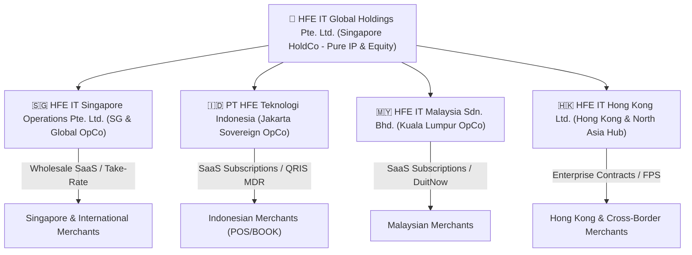
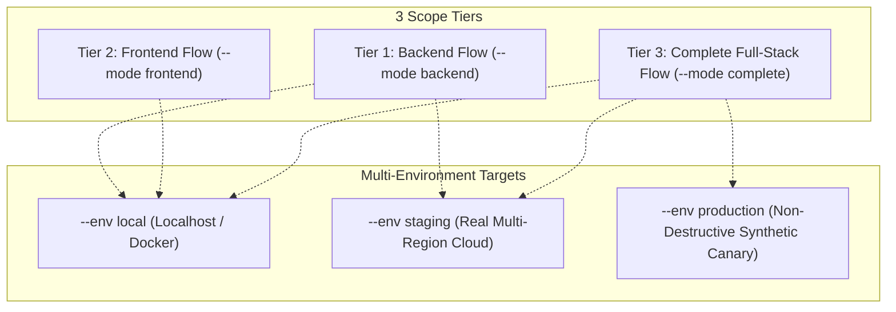
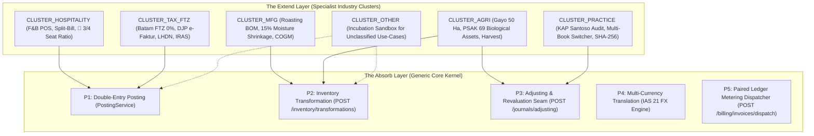
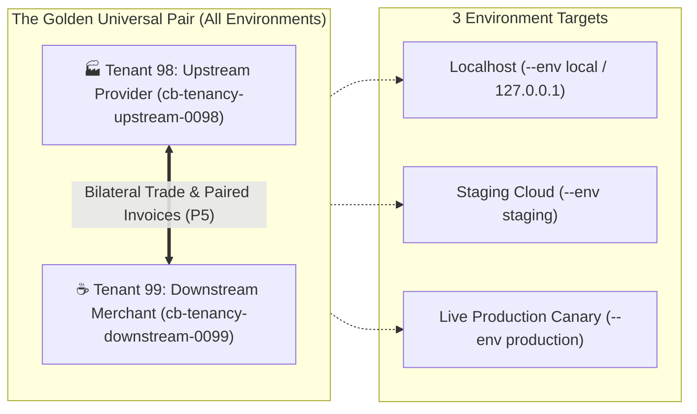

# HFE Ecosystem: Business Model, Product Topology & Multi-Tenancy Architecture

**Document ID:** `GLC-ARCH-TENANCY-001`  
**Status:** Approved Technical & Commercial Standard  
**Effective Date:** 2026-08-17  
**Corporate Entity Hierarchy:**  
- **Ultimate Global Holding:** HFE IT Global Holdings Pte. Ltd. (Singapore)
- **Singapore Operating OpCo:** HFE IT Singapore Operations Pte. Ltd. (Singapore)
- **Indonesia Operating OpCo:** PT HFE Teknologi Indonesia (Jakarta, Indonesia)
- **Malaysia Operating OpCo:** HFE IT Malaysia Sdn. Bhd. (Kuala Lumpur, Malaysia)
- **Hong Kong Regional Hub:** HFE IT Hong Kong Ltd. (Hong Kong SAR)

---

## 1. Corporate Topology & The 5-Stage Global Expansion Sequence

### 1.1 Multi-Tier Corporate Structure
PT HFE IT and its global group operate a multi-tier B2B2B commerce and financial technology platform partitioned into a Pure Asset Holding Company (HoldCo) and Regional Operating Companies (OpCos):



### 1.2 The 5-Stage Global Expansion Roadmap
1. **Stage 1: Singapore Genesis & Initial Global Hub (`SG`)**:
   - Initial incorporation via Sleek Singapore, built-in Xero Connector, PayNow SGD integration, and early cross-border pilot.
   - Operates the full suite of HFE features globally from Day 1.
2. **Stage 2: Indonesia Sovereign Subholding & Jakarta Node (`INA`)**:
   - Establishment of **PT HFE Teknologi Indonesia** (`Tenant 10`) and AWS Jakarta on-soil server node (`ap-southeast-3`) to strictly comply with Indonesian data sovereignty laws (UU PDP No. 27/2022 & PP No. 71/2019).
   - Integration with BCA SNAP BI, Dynamic QRIS, and DJP e-Faktur 4.0.
   - Migration of Indonesian merchant contact data to the domestic operating subledger.
3. **Stage 3: Malaysia Regional SEA Expansion (`MY`)**:
   - Expansion to Malaysia, establishing **HFE IT Malaysia Sdn. Bhd.** (`Tenant 12`), integration with **DuitNow QR (PayNet)**, FPX Online Banking, and **LHDN e-Invoicing** compliance in Ringgit (MYR).
4. **Stage 4: Corporate Restructuring: Clean HoldCo vs. Global Operating Split in Singapore**:
   - Separation into **`HFE IT Global Holdings Pte. Ltd.` (HoldCo - Tenant 01)** holding 100% Core IP and **`HFE IT Singapore Operations Pte. Ltd.` (SG OpCo - Tenant 11)** operating the commercial platform, achieving complete liability ring-fencing.
5. **Stage 5: Hong Kong Greater China & North Asia Regional Hub (`HK`)**:
   - Establishment of **HFE IT Hong Kong Ltd.** (`Tenant 30`), integration with **HKMA Faster Payment System (FPS)**, Inland Revenue Department (IRD) profits tax, and Greater Bay Area cross-border trade settlements (HKD/CNY/USD).

---

## 2. Product Portfolio & Unified Frontend Surfaces

| Product ID | Product Name | Description & Primary Capabilities | Target User Persona | Revenue Model |
| :--- | :--- | :--- | :--- | :--- |
| **Produk 1** | **HFE Core** | Headless Financial Posting Kernel, TigerBeetle Engine, 50-Connector Connect Hub, Tax Engine, Multi-Tenant Database. | Platform Operators, Core System Engineers | **Revenue Stream 1**: B2B Engine Usage (Per API mutation / monthly engine license). |
| **Produk 2** | **Hfeit POS** | Fast Cashier Register, Numpad, Cash Drawer Shift Sessions, Table Floorplans, KDS Kitchen Display, Local Stocktake. | Cashiers, Baristas, Store Managers | **Revenue Stream 2**: Monthly SaaS per register/outlet or transaction take-rate. |
| **Produk 3** | **Hfeit ORDER** | O2O Omnichannel Guest Dining, QR Table Self-Service Ordering, Instant Menu Cart, Payment Gateway (QRIS/Card). | Dine-in Restaurant Guests, Takeaway Customers | Included in SaaS Bundle / Small micro-fee per QR order. |
| **Produk 4** | **Hfeit BOARD** | Merchant Digital Storefront, Visual Menu Showcase, Brand Profile (Evolution of the Sekeding concept). | General Public, Online Customers | Included in Merchant Showcase Suite. |
| **Produk 5** | **Hfeit CARD** | Personal Consumer Loyalty Wallet, Digital Member Pass, Points Balance, Personal Receipts History. | Loyal Individual Consumers & Members | Loyalty Engine Module / Add-on. |
| **Produk 6** | **Hfeit BOOK** | Rebuilt CB-Client: Chart of Accounts, Double-Entry General Journals, Trial Balance, Balance Sheet, P&L, e-Faktur Pajak, & Multi-Entity Practice. | Enterprise Merchants, CFOs, Accounting Firms, CPAs | Core Ledger & Enterprise Add-on. |

### 2.1 Unified Frontend Experience for Merchant & Super-Admin
Super-Admins manage the entire platform directly through the official **HFE-X Frontend Platform (`hfe-pos`)**:
- **Pilar 0 [CORE] (`CoreLandingView.tsx` & `ConnectHubAdminView.tsx`)**: Connect Hub 50-connector catalog management, Webhook Relay inspector, and embedded Scalar OpenAPI Explorer.
- **Pilar 2 [ADMIN] (`AdminPortalView.tsx`)**: Cell Shard live rebalancer, Four-Eyes Approval center, Wholesale B2B metering console, and Multi-Company Holding governance.

---

## 3. Multi-Tenancy & Provisioning Architecture

### 3.1 Tenant Allocation Rules & The 2-Digit System Space (`01 .. 99`)
To ensure complete mathematical synergy with our 2-digit segmented naming convention (`01-01-01`), **Tenant IDs 01 through 99 are strictly reserved for HFE-IT Infrastructure & Regional OpCos**:

```text
 ┌─────────────────────────────────────────────────────────────────────────────────────────────────┐
 │ 👑 BLOK 01 - 09: CORE HOLDINGS & MASTER PLATFORM INFRASTRUCTURE                                 │
 │    • Tenant 01: HFE IT Global Holdings Pte. Ltd. (Global HoldCo & Core IP Master)              │
 │    • Tenant 02: HFE-IT Experience Global (Platform Operator & Wholesale Reseller Mesh)          │
 │    • Tenant 03: HFE Global Connect Hub & Third-Party Relay Node                                 │
 │    • Tenant 04: HFE Global Treasury & FX Settlement Clearing Node                               │
 │    • Tenant 05: HFE Developer Sandbox & Simulation Environment                                  │
 │    • Tenant 06: HFE Security, Audit & Compliance Archival Vault                                 │
 │    • Tenant 07 - 09: Reserved for AI Autonomous Financial Kernels & DR Recovery                 │
 ├─────────────────────────────────────────────────────────────────────────────────────────────────┤
 │ 🌏 BLOK 10 - 29: ASIA TENGGARA (ASEAN REGIONAL OPCOS)                                           │
 │    • Tenant 10: PT HFE Teknologi Indonesia (Jakarta Sovereign OpCo)                             │
 │    • Tenant 11: HFE IT Singapore Operations Pte. Ltd. (Singapore OpCo)                          │
 │    • Tenant 12: HFE IT Malaysia Sdn. Bhd. (Kuala Lumpur OpCo)                                   │
 │    • Tenant 13: HFE IT Thailand Co., Ltd.                                                       │
 │    • Tenant 14: HFE IT Vietnam LLC                                                              │
 │    • Tenant 15: HFE IT Philippines Inc.                                                         │
 │    • Tenant 16 - 29: Reserved for Southeast Asian Markets & Regional Expansion                  │
 ├─────────────────────────────────────────────────────────────────────────────────────────────────┤
 │ 🏮 BLOK 30 - 49: ASIA TIMUR & PASIFIK (EAST ASIA & OCEANIA OPCOS)                               │
 │    • Tenant 30: HFE IT Hong Kong Ltd. (Greater China & North Asia Hub)                          │
 │    • Tenant 31: HFE IT Japan K.K.                                                               │
 │    • Tenant 32: HFE IT Australia Pty Ltd.                                                       │
 │    • Tenant 33: HFE IT South Korea Co., Ltd.                                                    │
 │    • Tenant 34 - 49: Reserved for Asia-Pacific Regional Hubs                                    │
 ├─────────────────────────────────────────────────────────────────────────────────────────────────┤
 │ 🌍 BLOK 50 - 69: EROPA & TIMUR TENGAH (EMEA OPCOS)                                              │
 │    • Tenant 50: HFE IT UK Ltd. (London Hub)                                                     │
 │    • Tenant 51: HFE IT UAE Ltd. (Dubai Hub)                                                     │
 │    • Tenant 52: HFE IT Europe B.V. (Amsterdam Hub)                                              │
 │    • Tenant 53 - 69: Reserved for Middle East & European Markets                                │
 ├─────────────────────────────────────────────────────────────────────────────────────────────────┤
 │ 🗽 BLOK 70 - 89: AMERIKA (AMERICAS OPCOS)                                                       │
 │    • Tenant 70: HFE IT US Inc. (Americas Hub)                                                   │
 │    • Tenant 71: HFE IT Canada Ltd.                                                              │
 │    • Tenant 72 - 89: Reserved for North & Latin American Markets                                │
 ├─────────────────────────────────────────────────────────────────────────────────────────────────┤
 │ 🛡️ BLOK 90 - 99: SPECIAL PURPOSE VEHICLES (SPV) & EMERGENCY BREAK-GLASS NODES                   │
 ├─────────────────────────────────────────────────────────────────────────────────────────────────┤
 │ 🛒 BLOK 100+: PUBLIC COMMERCIAL MERCHANTS (KAFE, RESTO, RETAIL & ENTERPRISE PELANGGAN)          │
 │    • All commercial merchant registrations are dynamically provisioned starting at Tenant 100+. │
 └─────────────────────────────────────────────────────────────────────────────────────────────────┘
```

### 3.2 Provisioning Flow for Commercial Merchants (Tenant 100+)
1. When a new Merchant signs up on HFE-IT Experience:
2. HFE-IT Experience invokes the HFE Core provisioning endpoint:
   ```http
   POST /api/v2/company-books/provision
   Content-Type: application/json
   
   {
     "company_name": "Restoran Kopi ABC",
     "billing_parent_tenant_id": "TENANT-02",
     "coa_template": "ID_FNB_STANDARD",
     "tax_profile": "ID_PPN_11"
   }
   ```
3. HFE Core provisions a new company book (e.g. `TENANT-0100` / `company_book_id UUID`).
4. The merchant operates POS, ORDER, BOARD, and CARD within their own isolated book boundaries.
5. At the end of the billing cycle:
   - **HFE Core** meters engine compute/posting volume and invoices **Tenant 02 (HFE-IT Experience / OpCo)**.
   - **OpCo** bills the **Merchant** according to its merchant subscription/transaction pricing.

---

## 4. Architectural Invariants & Hard Constraints

1. **Zero Cross-Tenant Data Leakage**: Every query and mutation in HFE Core must enforce `WHERE company_book_id = $merchant_book_id`.
2. **Immutable System Definitions**: Merchants instantiate connectors and CoA templates from Tenant 01, but cannot alter the root definitions.
3. **Financial Posting Kernel Invariant**: No direct SQL updates to account balances; all financial movements must resolve through `PostingService` and double-entry debits/credits.
4. **Permanent Audit Trail**: Posted journals and finalized period close records cannot be hard-deleted; corrections must execute via reversal entries.
5. **Asset Isolation**: Connector icons and platform assets resolve through `tenant01` contact subledgers with zero untrusted external CDN dependencies.
6. **Zero-Downtime High Availability Gate**: All database migrations and cell node rebalancing must execute online without dropping active cashier connections ($99.999\%$ SLA target).

---

## 5. Repository Topology & Mapping

- **Backend Repository (`headless-company-books`)**:
  - Contains **Produk 1 (HFE Core Engine)**.
  - **Single Source of Truth (SSOT)** for all Canonical Master Business Scenarios (`docs/active/scenarios/`).
  - Master Orchestrator: `python3 scripts/hfe-rad0.py`
- **Frontend Repository (`hfe-pos`)**:
  - Contains **HFE-X Platform (Produk 2..5: POS, ORDER, BOARD, CARD + Rebuilt BOOK)**.
  - Contains Thin Markdown Pointer Stubs and Frontend-Specific UI Interaction Scenarios.
  - Master Orchestrator: `python3 scripts/hfex-rad0.py`

---

## 6. Unified Contact Subledger & Dynamic Namespaced Scope (`Hfeit:<SCOPES>`)

All corporate, partner, regulator, merchant, and consumer contacts across HFE Core and HFE-IT Experience are centrally managed in **Tenant 01's Contact Subledger** with local operational delegation. 

To prevent cross-product data duplication and cleanly track lifecycle progression, contacts are partitioned using the **`Hfeit:<SCOPES>`** dynamic namespace:

### 6.1 Canonical Scope Tokens
- `CORE`: Internal platform, cloud infrastructure, financial regulators, and connector master definitions (e.g. BCA SNAP, Xero, DJP e-Faktur, AWS, IRAS, LHDN, HKMA).
- `MERCHANT`: Business entities originating from Full Merchant Signups (POS / Backoffice / Cashier users).
- `BOARD`: Entities originating from Storefront / Landing Page-only signups (Evolusi Sekeding).
- `CARD`: Individual consumer members originating from Digital Loyalty Card signups.
- `AUDITOR_PRACTICE`: Accounting firms, CPAs, and corporate secretarial partners managing multiple client books.

### 6.2 Multi-Scope Combinations
A single contact entity can seamlessly hold multiple scope tags as their relationship evolves, separated by commas:
- `Hfeit:CORE` — Platform master connector or bank API partner.
- `Hfeit:BOARD` — Small food stall utilizing only digital menu storefront.
- `Hfeit:CARD` — Individual consumer holding a member pass.
- `Hfeit:MERCHANT,BOARD` — Merchant running in-store POS with active online storefront.
- `Hfeit:BOARD,MERCHANT,CARD,BOOK` — Full-ecosystem enterprise merchant running POS, online storefront, loyalty member cards, and general ledger.

---

## 7. Group Policy Data Management & Dual-Tier Contact Governance

Corporate contacts operate under a **Dual-Tier Governance Model** governed by `GroupPolicy: DataManagementPolicy`:
1. **Global Holding Master Registry (Tenant 01 - Singapore)**: Retains global corporate entity metadata (Legal Name, Global ID, Valuation, Contract Tier) for investor reporting, group valuation, and global AML screening.
2. **Local Operating Subledgers (Jakarta, KL, HK)**: Directly manage granular local operational data (NPWP/Tax IDs, local PIC contacts, local bank feeds, and cashier logins).
3. **Data Residency Compliance (UU PDP)**: Upward synchronization strips private personal identification information (PII), transmitting only anonymized financial summaries and corporate entity profiles to Holding.

---

## 8. Zero-Downtime Cell-Based Architecture & Dynamic Routing Mesh

To achieve our **Target 0 Downtime (99.999% SLA)** and dynamically scale nodes across regions:
1. **Global Anycast Edge Router**: Inspects incoming API requests (`X-Company-Book-Id` or OIDC JWT target claim) in $<0.1\text{ms}$.
2. **Global Cell Directory**: In-memory routing table mapping each `company_book_id` to its assigned server cell:
   - `JKT-CELL-01..N` (Jakarta Multi-Cell Cluster)
   - `SIN-CELL-01..N` (Singapore Multi-Cell Cluster)
   - `KUL-CELL-01..N` (Kuala Lumpur Multi-Cell Cluster)
   - `HKG-CELL-01..N` (Hong Kong Multi-Cell Cluster)
3. **Online Live Rebalancing**: Nodes can be provisioned in seconds. Moving a merchant between cells utilizes background dual-write replication and an atomic $<1\text{ms}$ routing flip with zero dropped connections.

---

## 9. The Master End-to-End Lifecycle Scenario (`SCN-FULL-ECOSYSTEM-01`)

The following real-world scenario connects all 6 products across both repositories, the 5-stage expansion roadmap, and the complete Seed-to-Cup conglomerate journey:

### Act 1: Genesis & The Humble Food Cart (Produk 4: Hfeit BOARD)
- **Actor**: Mas Budi launches a roadside coffee cart ("Warung Kopi Budi").
- **Action**: Budi signs up on HFE-IT Experience needing only a digital menu & landing page (`Hfeit:BOARD`).
- **Execution**: HFE Core creates an isolated `company_book_id` (`Tenant 100`). Menu goes live at `kopibudi.hfeit.board`.

### Act 2: Viral Success & Physical Expansion (Produk 2 & 3: POS & ORDER)
- **Event**: Warung Kopi Budi goes viral. Budi opens a 20-table cafe.
- **Action**: Budi clicks "Activate POS Register & QR Dining" in HFE-X.
- **Execution**: State machine promotes scope: `Hfeit:BOARD` ──► `Hfeit:BOARD,MERCHANT`. Terminals activate fast numpad POS, table floorplans (`CapacityBadge 👥 3/4 Kursi`), and QR table stickers (Produk 3 Hfeit ORDER) on tables 1..20.

### Act 3: Rush-Hour Power Outage & Network Failure (Offline-First Resilience)
- **Event**: Friday rush-hour (150 diners). Fiber-optic cable severed.
- **Execution**: Cashiers continue ordering and printing tickets via **IndexedDB client storage**. Upon internet recovery 90 minutes later, HFE-X flushes sync buffer with `X-Idempotency-Key` headers to HFE Core. All 150 transactions post with zero duplicates.

### Act 4: Split-Bill & Customer Loyalty (Produk 5: Hfeit CARD)
- **Event**: Table 8 (4 guests) completes dining. Guest A presents **Hfeit CARD** (VIP Member Pass) to redeem 500 points.
- **Execution**: Remaining balance split 4 ways via Dynamic QRIS. Webhook Relay matches callbacks against BCA SNAP BI bank feed, posting double-entry settlements and freeing Table 8.

### Act 5: Enterprise Scaling & Self-Managed Accounting (Produk 6: Hfeit BOOK)
- **Event**: Monthly revenue exceeds Rp 2 Billion. Budi activates **Modul BOOK** (`Hfeit:BOARD,MERCHANT,CARD,BOOK`).
- **Execution**: HFE Core constructs Chart of Accounts, General Journals, Trial Balance ($Debits == Credits$), and exports DJP e-Faktur 4.0 XML/CSV slips.

### Act 6: Professional Accounting Practice & External Audit (Multi-Book Practice)
- **Event**: Budi retains external accounting firm *KAP Santoso & Rekan*.
- **Execution**: KAP Santoso uses the **Multi-Book Switcher** in HFE-X (`Hfeit:AUDITOR_PRACTICE`) to manage 50 client books, posting adjusting entries with SHA-256 digital audit seals.

### Act 7: Wholesale Settlement & Platform Profit Realization
- **Event**: Month-End Billing Settlement.
- **Execution**: HFE Core (Tenant 01) calculates compute mutations and invoices Wholesale Engine Fee of Rp 150.000 to Tenant 02. Tenant 02 bills Budi's retail SaaS of Rp 499.000 via Virtual Account auto-debit.

### Act 8: Singapore Global Expansion & The Sleek Adoption Journey (Stage 1)
- **Event**: PT HFE IT expands internationally, incorporating **HFE IT Global Pte. Ltd.** in Singapore via **Sleek Singapore**.
- **Execution**: Sleek clients operate on Xero; HFE IT uses **`BOOK`**. HFE IT deploys its native **Xero Connector** in Connect Hub to sync PayNow SGD bank feeds. Observing HFE's superior multi-jurisdiction engine, Sleek signs a Strategic Enterprise Agreement and migrates regional clients onto **HFE `BOOK`**.

### Act 9: Indonesian Subholding & Domestic Enterprise Sales (Stage 2)
- **Event**: Explosive domestic growth leads to the formal incorporation of **PT HFE Teknologi Indonesia** (`Tenant 10`) on AWS Jakarta server nodes (`ap-southeast-3`).
- **Execution**: PT Indo closes an enterprise implementation deal with Boga Group (120 restaurant branches), issuing official DJP PPN 11% invoices in IDR. All Indonesian merchant contacts are re-homed into the domestic sovereign subledger.

### Act 10: Malaysia Regional Expansion & DuitNow Integration (Stage 3)
- **Event**: HFE expands to Malaysia, establishing **HFE IT Malaysia Sdn. Bhd.** (`Tenant 12`).
- **Execution**: HFE Core activates the **MY Jurisdictional Profile**, integrating **DuitNow QR (PayNet)**, FPX banking feeds, and **LHDN e-Invoicing** compliance for hundreds of cafes in Kuala Lumpur and Penang.

### Act 11: Corporate Restructuring: Clean HoldCo vs. Global OpCo Split (Stage 4)
- **Event**: Group volume reaches institutional enterprise scale.
- **Execution**: HFE formalizes the separation into **`HFE IT Global Holdings Pte. Ltd.` (HoldCo - Tenant 01)** holding 100% Core IP and **`HFE IT Singapore Operations Pte. Ltd.` (SG OpCo - Tenant 11)** operating the commercial platform, achieving complete liability ring-fencing.

### Act 12: Hong Kong Regional Hub & Greater Bay Cross-Border Trade (Stage 5)
- **Event**: Establishment of **HFE IT Hong Kong Ltd.** (`Tenant 30`) to serve North Asia.
- **Execution**: Integration with **HKMA Faster Payment System (FPS)** and IRD Profits Tax. HFE Core handles multi-currency cross-border trade settlements across HKD, SGD, MYR, IDR, and USD seamlessly with automatic intercompany eliminations.

### Act 13: The "Seed-to-Cup" Conglomerate Evolution (Nusantara Coffee Group)
This act demonstrates how a single tenant scales through the full multi-product, multi-company, and multi-country capability matrix:
1. **Phase 1 (BSD Cafe - Merchant Suite on Singapore Node)**: Mas Budi opens a cafe in BSD using only the Merchant Suite (`POS`, `ORDER`, `CARD`). He does not use formal double-entry bookkeeping (`BOOK`) yet, tracking only daily cash shifts on Singapore Server Node `SIN-CELL-01`.
2. **Phase 2 (Roasting Factory - The Aha! Moment & BOOK Activation)**: Budi builds a coffee roasting factory (PT Nusantara Sangrai) to supply his cafe and sell wholesale. Facing manufacturing complexity (green bean shrinkage, gas costs, wholesale receivables), Budi upgrades to **`BOOK`** (`Hfeit:BOARD,MERCHANT,CARD,BOOK`), unlocking Bill of Materials (BOM) inventory assembly and double-entry general ledger.
3. **Phase 3 (Indonesian Data Sovereignty Mandate & Live Zero-Downtime Migration)**: Indonesian regulators (UU PDP / BI) mandate on-soil data residency. HFE commissions the Jakarta Server Node (`ap-southeast-3` / `JKT-CELL-01`). HFE Core executes a **Live Shard Dual-Write Migration** moving Budi's BSD Cafe and Roasting Factory books from Singapore to Jakarta with $<1\text{ms}$ atomic routing flip and 0 dropped cashier carts.
4. **Phase 4 (Singapore Global Trading & 50-Ha Gayo Plantation)**: Budi incorporates **Nusantara Coffee Global Pte. Ltd.** in Singapore via Sleek (hosted on Singapore Node) for container exports to Tokyo/London, and acquires a **50-Ha Coffee Plantation in Gayo** (hosted on Jakarta Node under PSAK 69 Biological Asset Accounting). Budi manages his entire seed-to-cup empire across **POS, BOOK, 4 Companies, and 2 Countries** from a single HFE-X console!

---

## 10. Scenario-Driven Preset Accumulation Engine

Every executed business scenario automatically compiles into our production-ready **System Presets Registry in Tenant 01**:
1. **Chart of Accounts (CoA) Presets**: `COA_ID_FNB_CAFE`, `COA_ID_ROASTING_MFG`, `COA_ID_AGRICULTURE_FARM`, `COA_SG_CROSSBORDER_TRADING`, `COA_MY_RETAIL_FNB`, `COA_HK_REGIONAL_TRADING`.
2. **Business Policy (`CompanyPolicy`) Presets**: `POLICY_CAFE_FAST_CASHIER`, `POLICY_ROASTING_BOM_SHRINKAGE`, `POLICY_PLANTATION_FAIR_VALUE`, `POLICY_WHOLESALE_METERING`.
3. **Jurisdictional Tax Presets**: `TAX_ID_PB1_PPN`, `TAX_SG_IRAS_GST_9`, `TAX_MY_LHDN_EINVOICE`, `TAX_HK_IRD_PROFITS`.

---

## 11. The 3-Tier E2E Scope Hierarchy & Multi-Environment Matrix



### 11.1 The 3 Scope Tiers
1. **Tier 1: Flow Backend (`--mode backend`)**: Tests the 13 acts strictly against the **Public OpenAPI 3.1 Contract** (`Authorization: Bearer <JWT>`, `X-Company-Book-Id`, `X-Idempotency-Key`, `X-Hfe-Signature`) and the **Internal Admin Control Plane** (`/api/v2/admin/...`) without private struct shortcuts.
2. **Tier 2: Flow Frontend (`--mode frontend`)**: Tests visual UI interactions, React Aria headless atoms, IndexedDB offline buffer, Defensive Spatial Isolation, and tabular numerals across merchant and admin surfaces.
3. **Tier 3: Flow Complete Full-Stack (`--mode complete`)**: Tests the unified bridge connecting frontend UI clicks directly to backend TigerBeetle posting kernels.

### 11.2 The Multi-Environment Targets
- `--env local`: Runs against localhost (`http://127.0.0.1:8080`) for rapid pre-commit validation.
- `--env staging`: Runs against real multi-region cloud infrastructure (`https://api.staging.hfeit.com`) across Singapore (`ap-southeast-1`) and Jakarta (`ap-southeast-3`) with real network latency and live failover tests.
- `--env production`: Runs non-destructive synthetic canary audits in live production.

---

## 12. Hierarchical Scenario Tree, 360° Pairing Matrix, Smart Failure Caching & Curated Ingestion

### 12.1 Arbitrary Depth Scenario Tree (L0 ──► L1 ──► L2 .. LN)
All business scenarios live in `docs/active/scenarios/` following the 2-digit segmented lineage format (`01-01-01-slug.md`):
- **`level-0/`**: Master Grand Ecosystem Lifecycles (`00-master-hfe-ecosystem-lifecycle.md`).
- **`level-1/`**: Subsystem Domain Lifecycles (`01-01-fnb-o2o-retail-lifecycle.md`, `01-02-manufacturing-assembly-bom.md`).
- **`level-2/`**: Executable Test Scenarios (`01-01-01-bsd-cafe-pos-offline-splitbill.md`).

### 12.2 The 360-Degree Scenario-to-Test Pairing Matrix
Every Level 2 scenario document explicitly binds its deterministic verification footprint in its YAML frontmatter:
1. **Presets Injected**: `coa_template`, `business_policy`, `tax_profile`.
2. **Public Endpoints Tested**: OpenAPI 3.1 operations.
3. **Backend Proofs Required**: Ignored integration proofs.
4. **Frontend Vitest Suites**: Component UI tests.
5. **Invariant Assertion Gates**: Posting $Debits == Credits$, UUID isolation, DOM bounding-box overlap gates.

### 12.3 Deterministic Incremental Failure Caching & Smart Re-Run (`--failed` / `-F`)
The master runner maintains an execution state ledger in `.radar/e2e_state.json`. When a developer executes:
```bash
python3 scripts/e2e-master-runner.py --failed
```
The runner instantly skips all green scenarios and re-executes only previously failed scenarios in sub-second latency.

### 12.4 The 4-Step Feedback Curation & Normalization Gate
To prevent noisy, informal, or raw proprietary data from polluting the scenario repository, all real-world user feedback must pass the 4-step curation filter:
1. **Domain Essence Extraction**: Strips emotional noise and extracts the underlying architectural invariant.
2. **Generalization & Persona Assignment**: Replaces private PII with canonical test entities (e.g. Nusantara Food Group).
3. **4-Quadrant Parameterization**: Defines test cases across Empty (Q1), Short (Q2), Long/Billion IDR (Q3), and Partial/Multi-State (Q4).
4. **Formal L2 Specification & Pairing**: Formats into standard YAML frontmatter and registers paired backend/frontend proofs.

### 12.5 Single Source of Truth (SSOT) Scenario Repository Governance
To eliminate stale documentation and dual-maintenance drift across repositories:
1. **`headless-company-books` is the Sole Master SSOT**: All canonical scenario definitions, YAML frontmatters, and 360° pairing matrices are exclusively authored and maintained in `docs/active/scenarios/` of `headless-company-books`.
2. **`hfe-pos` Uses Thin Markdown Links**: The scenario directory in `hfe-pos` contains lightweight pointers referencing the master scenarios in `headless-company-books` plus pure frontend UI interaction scenarios.
3. **Automated Cross-Repo Parity Sentinel**: `python3 scripts/hfe-rad0.py` and `python3 scripts/hfex-rad0.py` automatically verify link resolution integrity (0 broken links).

---

## 13. The "Absorb-and-Extend" Architecture, Specialist Clusters & `CLUSTER_OTHER` Incubation Lifecycle

The core architectural operating principle of Headless Company Books is **"Absorb generic patterns into the core kernel + Extend niche requirements via specialist connectors + Group niche patterns into structured clusters"**.



### 13.1 The 5 Generic Kernel Primitives (The Absorb Layer)
The Core Financial Kernel remains strictly minimalist, sovereign, and modular (<500 lines per file):
1. **P1: Double-Entry Posting Engine (`financial_kernel::posting`)**: Atomic zero-penny imbalance debits==credits posting.
2. **P2: Inventory Transformation Seam (`POST /inventory/transformations`)**: Consumes input items $\rightarrow$ produces output items with shrinkage/abnormal variance tracking and automated COGM posting.
3. **P3: Adjusting & Revaluation Seam (`POST /journals/adjusting` & `POST /periods/close`)**: Adjusting entries, asset revaluation, and immutable period closing seals.
4. **P4: Multi-Currency Translation Kernel (`IAS 21 FX Engine`)**: Foreign subsidiary trial balance conversion and intercompany AR/AP reciprocal eliminations.
5. **P5: Paired Ledger Metering Dispatcher (`POST /billing/invoices/dispatch`)**: Synchronized paired journals between Platform HoldCo (Tenant 01) and Commercial OpCos (Tenant 02..99).

### 13.2 The 5 Canonical Specialist Clusters (The Extend Layer)
Niche domain logic lives as pluggable extension packs in Connect Hub & Policy Presets:
1. **`CLUSTER_HOSPITALITY`**: Fast cashier shifts, IndexedDB offline buffer, 4-way split-bill, and dynamic table floorplan capacity badges (`👥 seated/max`).
2. **`CLUSTER_MFG`**: Roasting BOM assembly recipes, 15% natural moisture shrinkage calculations, direct labor, and utility overhead allocation.
3. **`CLUSTER_AGRI`**: PSAK 69 / IAS 41 Biological Asset growth fair value adjustments and point-of-harvest fresh cherry conversion into produce inventory.
4. **`CLUSTER_TAX_FTZ`**: Batam FTZ 0% VAT exemption, Indonesian DJP e-Faktur 4.0, Malaysian LHDN e-Invoice API, and Singapore IRAS GST 9%.
5. **`CLUSTER_PRACTICE`**: KAP Santoso external CPA audit practice, Multi-Book Switcher, and SHA-256 digital closing seals.

### 13.3 The `CLUSTER_OTHER` Incubation Sandbox & Data-Driven Promotion Protocol
To avoid premature categorization while maintaining zero-friction adoption:
1. **Incubation in `CLUSTER_OTHER`**: Any novel business scenario or user feedback not fitting the 5 baseline clusters is tagged as `CLUSTER_OTHER`. It executes immediately using the 5 Core Kernel Primitives without kernel modifications.
2. **Density Monitoring Threshold ($\ge 3$ items)**: Master Radar (`hfe-rad0.py` / `hfex-rad0.py`) tracks item density in `CLUSTER_OTHER`. When $\ge 3$ related scenarios accumulate sharing a common industry ontology (e.g. 3 healthcare/clinic scenarios), Radar flags a candidate promotion insight:
   `💡 CLUSTER CANDIDATE DETECTED: 3 items in OTHER share medical ontology -> Propose CLUSTER_HEALTHCARE`.
3. **Formal Promotion & Re-Grouping**: Upon architectural approval, the candidate is promoted to a canonical cluster, schema registries are updated, and items are migrated from `CLUSTER_OTHER` to the new dedicated cluster pack.

### 13.4 Multi-Cadence Visual QA Dev Toolkit
Inspection and testing support 3 distinct operational cadences:
- **Small / Fast Headless (`--visual none`)**: Ultra-fast AST and logical assertions (<100ms per scenario) for git pre-commit sentinels.
- **Medium / 4-Quadrant DOM Layout (`--visual snapshot`)**: Evaluates the 4-Quadrant Matrix (Empty, Short, Long 1.8B IDR, Multi-State) and asserts non-overlapping bounding boxes without full browser overhead.
- **Large / Live Interactive QA (`--visual live`)**: Launches the live browser / In-App `ScenarioPlayerWidget` in HFE-X, driving visual inputs with customizable playback speeds (`1x`, `5x`, `Turbo`) and step-by-step state verification.

---

## 14. The Dual-Phase Onboarding Paradigm & Single-Door Backend Settings Gateway

To reconcile the tension between rapid time-to-value for new merchants and the complex data reconciliation required for legacy system migrations, HFE establishes the **Two-Phase Progressive Disclosure Architecture**:

```mermaid
graph LR
    subgraph Phase1["Phase 1: Day-0 Fast Entry (Strict 3+1)"]
        W1["Step 1: Business Identity & Baseline Cluster"]
        W2["Step 2: Brand & Capacity Scale"]
        W3["Step 3: Jurisdiction, Currency & Cash Float"]
        W4["Step 4: Interactive System Preview"]
        W1 --> W2 --> W3 --> W4
    end

    subgraph Phase2["Phase 2: Day-1+ Living Getting Started Hub"]
        G1["Task 1: Legacy Migration & Account Mapping Seam"]
        G2["Task 2: Day-2 Specialist Cluster Enablement"]
        G3["Task 3: Bank Feeds & Digital Tax Certification"]
        G4["Task 4: Hardware POS ESC/POS Pairing"]
    end

    W4 == "Instant Provisioning (POST /provision)" ==> Phase2
```



### 14.1 The Strict "3 Steps + 1 Preview" Invariant (Day-0 Fast Entry <60s)
1. **Zero Cognitive Friction**: Every new merchant completes onboarding in $<60$ seconds answering only 3 simple operational questions.
2. **Step 4 Interactive Preview Gate**: Shows the exact generated tenancy boundary, assigned CoA template, opening cash drawer balance, and balanced debits==credits proof before committing.
3. **Atomic 1-Click Provisioning Seam (`POST /api/v2/company-books/provision`)**: Provisions the tenant, binds settings, seeds CoA, and posts the opening journal atomically.

### 14.2 The Living Getting Started Hub (Day-1..Day-N Progressive Lifecycle)
1. **Persistent Companion**: Remains accessible as an in-app workspace guide rather than a one-time disposable modal.
2. **Asynchronous Legacy Migration Seam**: Handles complex multi-thousand SKU imports, modifier mappings, and beginning trial balance reconciliations (Xero, Moka, Mekari Jurnal, Accurate, CSV/Excel) without delaying Day-0 launch.
3. **Non-Destructive Day-2 Cluster Evolution**: Enables merchants to add new specialist clusters (e.g. adding `CLUSTER_MFG` when opening a roasting factory) without resetting established historical ledger periods or cash floats.
4. **System-Verified Real Database Assertions**: Validates actual live transactional conditions in PostgreSQL (active staff $\ge 1$, cash float $>0$, registered PT) rather than artificial UI checkboxes.

### 14.3 The Single-Door Gateway $\longleftrightarrow$ Federated Capability Settings Architecture
In compliance with Architecture Rule #7 (*"Settings Own Accounting Behavior"*):
1. **Single Entrypoint**: All client surfaces read and update configuration exclusively through `GET /api/v2/company-books/{id}/settings` and `PUT /api/v2/company-books/{id}/settings`.
2. **Federated Domain Handlers**: The gateway dispatches domain-specific configurations to their respective capability submodules (`tax/`, `inventory/`, `pos/`, `bank/`, `connect_hub/`).
3. **Granular Scoped Mutations**: Supported via `PATCH /settings/{domain}` (e.g. `PATCH /settings/pos` for printer configuration) to prevent non-critical hardware errors from blocking critical fiscal/tax updates.
4. **Effective-Dated Immutable Provenance**: Every setting change generates an effective-dated successor version with cryptographic audit provenance.

---

## 15. The Universal Paired Testing Tenancy Standard (Tenant 98 ⟷ Tenant 99)

To eliminate multi-environment configuration drift and mental overhead, HFE establishes **One Canonical Paired Tenancy Constant Identical Across All Environments (Localhost, Staging Cloud, and Live Production)**:



### 15.1 The Canonical Role Allocation
1. **🏭 Tenant 98 (`cb-tenancy-upstream-0098`) — The Upstream Provider**:
   - Represents the Roastery Manufacturing Plant (`CLUSTER_MFG`), Gayo Coffee Plantation (`CLUSTER_AGRI`), or Wholesale Platform Operator (Tenant 02).
   - Owns raw material supply, wholesale compute invoices, and Accounts Receivable (AR).
2. **☕ Tenant 99 (`cb-tenancy-downstream-0099`) — The Downstream Merchant**:
   - Represents BSD Cafe POS Cashier (`CLUSTER_HOSPITALITY`), Table QR self-ordering, and Retail Commerce.
   - Owns coffee inventory receipt, shift floats, POS cashier sales, and Accounts Payable (AP).

### 15.2 Cross-Environment Determinism & Production Canary Safety
- **Environment Isolation**: Because database instances are physically isolated across Local (`127.0.0.1`), Staging (`db.staging.hfeit.com`), and Production (`db.prod.hfeit.com`), using the exact same IDs (`Tenant 98` & `Tenant 99`) is 100% safe and zero-pollution.
- **Zero Real Customer Impact in Production**: In Live Production, `Tenant 98` and `Tenant 99` operate strictly as a **Non-Destructive Synthetic Canary Sandbox**. Live roleplays and hourly canary sweeps execute against these tenants without polluting real commercial merchant accounts (Tenant 100+) or touching live bank rails.
- **Zero Dual-Infrastructure Spawning Friction**: Testing in early phases can be run directly against the single live production deployment targeting `Tenant 98` and `Tenant 99` without spawning or paying for redundant staging clusters.


